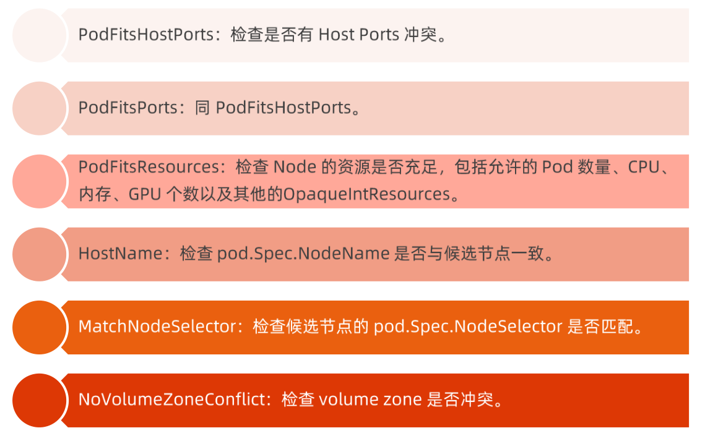

# kubernetes 控制平面组件

## 目录

* <a href="#P1">调度</a>

* <a href="#P2">Controller Manager</a>

* <a href="#P3">kubelet</a>

* <a href="#P4">CRI</a>

* <a href="#P5">CNI</a>

* <a href="#P6">CSI</a>

  


<a name="P1"></a>

## PART1. 调度

### kube-scheduler

kube-scheduler负责分配调度Pod到集群内的节点上，他监听kube-apiserver，查询未分配Node的pod， 然后根据调度策略为这些Pod分配节点（更新Pod的NodeName字段）。

调度器需要充分考虑多的因素：

* 公平调度；
* 资源高效利用；
* Qos；
* affinity 和 anti-affinity;
* 数据本地化（data locality）；
* 内部负载干扰（initer-workload interference）；
* deadlines。


### 调度器

kube-scheduler调度分为两个阶段，predicate和priority；

* predicate：过滤不符合条件的节点；
* priority：优先级排序，选择优先级高的节点。

通过两个阶段筛选节点放到数据，优先级高的排在前面，index 为0的即是最佳节点。

### Predicates 策略

PodFitsHostPorts：检查是否有 Host Ports 冲突。




### Predicates plugin 工作原理

比如当我们去做Pod调度的时候，他就是去遍历 Predicates plugin ，经过每个 plugin 都会过滤到一批节点，最后可能只剩下少数几个最合适的节点。经过  Predicate 以后就要做Porrinity plugin 遍历，经过每个 plugin 给每个节点打分，最后把这些分数汇总，得分最高的节点排在前面。


### Priorities 策略

* SelectorSpreadPriority：优先减少节点上属于通一个 Service 或 Replication Controller 的 Pod 数量。

* InterPodAffinityPriority：优先将 Pod调度到相同的拓扑上（如同一个节点、Rack、Zone等）。
* LeastRequestedPriority：优先调度到请求资源少的节点上。
* BalancedResourceAllocation：优先平衡各节点的资源使用。
* NodePreferAvoidPodsPriority： alpha.kubernetes.io/preferAvoidPods 字段判断，权重为 10000，避免其他优先级策略的影响。
* NodeAffinityPriority：优先调度到匹配的 NodeAffinity 的节点上。
* TainTolerAtionPriority：优先调度到匹配 TaintToleration 的节点上。
* ServiceSpreadingPriority： 尽量将同一个 service 的 Pod 分布到不同的节点上，已经被SelectorSpreadPriority 代替（默认未使用）。
* EqualPriority： 将大镜像的容器调度到已经下拉了该镜像的节点上（默认未使用）。
* MostRequestedPriority： 尽量调度到已经使用过的 Node 上，特别适用于 cluster-autoscaler （默认未使用）。

### CPU资源需求

* CPU
  * request
    * kubernetes 调度 Pod 时，会判断当前节点正在运行的 Pod 的 CPU Request 的总和， 再加上当前调度 Pod 的 CPU request，计算其是否超过节点的 CPU 的可分配资源。
  * limits
    * 配置 cgroup 以限制资源上限。
* 内存
  * request
    * 判断节点的剩余内存是否满足 Pod 的内存请求量，已确定是否可以将 Pod 调度到改节点和。
  * limits
    * 配置 cgroup 以限制资源上限。

调度器调度的时候会解读 Pod 的request， request 语意是说 Pod最少需要这么多资源。 limit 代表我这个Pod 最多需要这么资源，limit是给cgroup用来做资源限制的。

例子：

```
apiVersion: apps/v1
kind: Deployment
metadata:
  name: nginx-deployment
spec:
  replicas: 1
  selector:
    matchLabels:
      app: nginx
  template:
    metadata:
      labels:
        app: nginx
    spec:
      containers:
        - name: nginx
          image: nginx
          resources:
            limits:
              memory: 1Gi     #最大内存1Gi
              cpu: 1          #最大CPU 1个
            requests:
              memory: 256Mi             #最小资源256Mi
              cpu: 100m                 #m CPU单位，100m代表0.1个CPU
```


**LimitRange 对象**，凡是pod 不指定resource 的，给定一个默认资源。

```
apiVersion: v1
kind: LimitRange
metadata:
  name: mem-limit-range
spec:
  limits:
    - default:
        memory: 512Mi
      defaultRequest:
        memory: 256Mi
      type: Container
```

示例：

创建一个不指定资源的 Nginx

```
apiVersion: apps/v1
kind: Deployment
metadata:
  name: nginx-deployment
spec:
  replicas: 1
  selector:
    matchLabels:
      app: nginx
  template:
    metadata:
      labels:
        app: nginx
    spec:
      containers:
        - name: nginx
          image: nginx
```

create之后LimitRange 和 nginx deploy后，可以看到 Pod 已经设置了LimitRange指定的资源大小。


### 磁盘资源需求

容器临时存储（ephermeral storage） 包含日志和可写层数据，可通过定义 Pod Spec 中的 limits.ephemeral-storage 和 requests.ephemeral-storage 来申请。

Pod 调度完成后，计算节点对临时存储的限制不是基于cgroup的，而是由 kubelet 定时获取容器的日志和容器可写层的磁盘使用情况，如果超出限制，则会对pod进行驱逐。


### Init Container 的资源需求

Init Container主要作用是在主 Container 启动之前做一些初始化工作。 比如预先加载配置。

* 当 kube-scheduler 调度带有多个 Init 容器的 Pod 时， 只计算 cpu.reqeus 最多的init容器，而不是计算所有 init 容器的资源总和。
* 由于多个 init 容器是按顺序执行，并且执行完毕后立即退出，所以如果申请资源最多的 init 容器可以满足需求，其他 init容器同可。
* kube-scheduler 在计算该节点被占用的资源时， init 容器的资源也会被纳入计算。因为 init 容器在特定情况下可能被再次执行。比如由于更换镜像而引起的Sandbox重建时。


示例：

这个例子中initContainer 执行command，也就是sleep 10s 后退出，然后启动主 Container。

```
apiVersion: apps/v1
kind: Deployment
metadata:
  name: nginx-deployment
spec:
  replicas: 1
  selector:
    matchLabels:
      app: nginx
  template:
    metadata:
      labels:
        app: nginx
    spec:
      initContainers:
        - name: init-myservice
          image: busybox:1.28
          command: ['sh', '-c', 'echo The app is running! && sleep 10']
      containers:
        - name: nginx
          image: nginx
```


### Pod 调度到指定 Node 上。

可以通过nodeSelector、nodeAffinity、podAffinity 以及 Taints、tolerations 等将 Pod 调度到需要的 Node上。也可以通过 nodeName参数将 Pod 调度到指定 Node 节点上。

比如，使用 nodeSelector， 首先给 Node 加上标签：

```
kubectl label nodes <your-node-name> nodedisktype=ssd
```

接着可以指定 Pod 调度到带有 nodedisktype=ssd 标签的节点上。

```
apiVersion: v1
kind: Pod
metadata:
  name: nginx
  labels:
    app: nginx
spec:
  nodeSelector:
    nodedisktype: ssd
  containers:
  - name: nginx
    image: nginx
    imagePullPolicy: IfNotPresent
    
```

#### nodeSelector

首先给 Node 打上标签：

```
kubectl label nodes node1 nodedisktype=ssd
```

然后在 daemonset spec字段中指定 nodeSelector：

```
spec:
  nodeSelector:
    nodedisktype: ssd
```


#### nodeAffinity

nodeAffinity 目前支持两种：requiredDuringSchedulingIgnoredDuringExecution  和   preferredDuringSchedulingIgnoredDuringExecution ， 分别代表必须满足条件和优选条件。

***节点亲和性支持如下运算符*：**

* In：label的值在某个列表中；
* NotIn：label的值不在某个列表中；
* Gt：label的值大于某个值；
* Lt：label的值小于某个值；
* Exists：label存在；
* DoesNoExist：label不存在。


**硬节点亲和性示例：**

```
apiVersion: apps/v1
kind: Deployment
metadata:
  name: nginx-deployment
spec:
  replicas: 1
  selector:
    matchLabels:
      app: nginx
  template:
    metadata:
      labels:
        app: nginx
    spec:
      affinity:
        nodeAffinity:
          requiredDuringSchedulingIgnoredDuringExecution:        
            nodeSelectorTerms:
              - matchExpressions:
                  - key: nodedisktype
                    operator: In
                    values:
                      - ssd
      containers:
        - name: nginx
          image: nginx
```

requiredDuringSchedulingIgnoredDuringExecution: 硬亲和，代表必须满足条件

key： 指定标签名

operator：运算符，In代表在值在某列表中

values：值

上例子就是说，Pod 只能调度到包含nodedisktype标签并且标签值是ssd的节点中。


**软亲和示例**

```
apiVersion: apps/v1
kind: Deployment
metadata:
  name: nginx-deployment
spec:
  replicas: 1
  selector:
    matchLabels:
      app: nginx
  template:
    metadata:
      labels:
        app: nginx
    spec:
      affinity:
        nodeAffinity:
          preferredDuringSchedulingIgnoredDuringExecution:
          - weight: 1
            preference:
              matchExpressions:
                - key: disktype
                  operator: In
                  values:
                    - ssd
      containers:
        - name: nginx
          image: nginx
```

优先调度到满足条件的节点，如果都不满足也会调度到其他节点。


**软亲和+硬亲和示例**

```
apiVersion: apps/v1
kind: Deployment
metadata:
  name: nginx-deployment
spec:
  replicas: 1
  selector:
    matchLabels:
      app: nginx
  template:
    metadata:
      labels:
        app: nginx
    spec:
      affinity:
        nodeAffinity:
          requiredDuringSchedulingIgnoredDuringExecution:
            nodeSelectorTerms:
              - matchExpressions:
                  - key: nodedisktype
                    operator: In
                    values:
                      - ssd
          preferredDuringSchedulingIgnoredDuringExecution:
          - weight: 1
            preference:
              matchExpressions:
              # 表示node标签存在 nodetype=GPU
              - key: nodetype
                operator: In
                values:
                - GPU
      containers:
        - name: nginx
          image: nginx
```

首先满足硬亲和条件，只能调度到标签为nodedisktype 值为ssd的节点上。 然后根据硬亲和过滤出来的节点中优先调度到标签包含nodetype=GPU的节点，如果没有没关系，在其他没有nodetype=GPU标签里选。


#### podAffinity

跟节点亲和差不多，只不过节点亲和找的是 Node 的 Label， Pod亲和则是找 Pod 的 Label。同样requiredDuringSchedulingIgnoredDuringExecution和 preferredDuringSchedulingIgnoredDuringExecution，分别表示“硬”与“软”要求


pod硬亲和+反亲和示例

```
apiVersion: apps/v1
kind: Deployment
metadata:
  name: nginx-anti
spec:
  replicas: 2
  selector:
    matchLabels:
      app: anti-nginx
  template:
    metadata:
      labels:
        app: anti-nginx
    spec:
      affinity:
        podAffinity:
          requiredDuringSchedulingIgnoredDuringExecution:
          - labelSelector:
              matchExpressions:
                - key: a
                  operator: In
                  values:
                    - b
            topologyKey: kubernetes.io/hostname
        podAntiAffinity:
          requiredDuringSchedulingIgnoredDuringExecution:
          - labelSelector:
              matchExpressions:
                - key: app
                  operator: In
                  values:
                    - anti-nginx
            topologyKey: kubernetes.io/hostname
      containers:
        - name: with-pod-affinity
          image: nginx
```

首先，podAffinity亲和意思只能调度到标签a=b的节点上。其次podAntiAffinity反亲和，表示在标签a=b的节点中，不能选择含有app=anti-nginx标签的节点。


pod软亲和+反亲和示例

```
apiVersion: apps/v1
kind: Deployment
metadata:
  name: nginx-anti
spec:
  replicas: 2
  selector:
    matchLabels:
      app: anti-nginx
  template:
    metadata:
      labels:
        app: anti-nginx
    spec:
      affinity:
        podAffinity:
          preferredDuringSchedulingIgnoredDuringExecution:
          - weight: 100
            podAffinityTerm:
              labelSelector:
                # 由于是Pod亲和性/反亲和性；因此这里匹配规则写的是Pod的标签信息
                matchExpressions:
                - key: version
                  operator: In
                  values:
                  - v1
                  - v2
              topologyKey: kubernetes.io/hostname
        podAntiAffinity:
          preferredDuringSchedulingIgnoredDuringExecution:
          - weight: 100
            podAffinityTerm:
              labelSelector:
                matchExpressions:
                - key: app
                  operator: In
                  values:
                  - crowd-app
              topologyKey: kubernetes.io/hostname
      containers:
        - name: with-pod-affinity
          image: nginx
```


#### Taints和Tolerations

Taints 和 Tolerations 用于保证 Pod 不被调度到不合适的 Node 上，其中 Taint 应用于 Node 上，而 Toleration 则应用于 Pod上。

**目前支持的 Taint 类型：**

* NoSchedule：新的 Pod 不调度到该 Node 上， 不影响正在运行的 Pod。
* PreferNoSchedule： soft 版的NoSchedule，尽量不调度到该 Node。
* NoExecute： 新的 Pod 不调度到该， 并且删除（EVICT）已经在运行的 Pod。 Pod可以增加一个时间（tolerationSeconds）。

然而， 当 Pod 的 Tolerations 匹配 Node 所有的 Taints 的时候可以调度到该 Node 上； 当 Pod 已经运行也不会被删除。另外对于NoExecute，如果 Pod 增加了一个 tolerationSeconds， 则会在该时间后删除 Pod 。


**多租户 Kubernetes 集群-计算资源隔离**

kubernetes 集群一般是通用集群，可以被所有用户共享，用户无需关系计算节点细节。

但往往某些自带计算资源客户要求：

* 带着计算资源加入kubernetes集群；
* 要求资源隔离。

实现方案：

* 将要隔离的计算资源打上 Taints；
* 在用户创建 Pod 的时候，定义tolerations来指定要调度到 node Taints。


**Node 加 Taints**

```
kubectl taint node bj-ecs-l-d-shujiajia3 for-special-user=cadmin:NoSchedule
```


**Pod 加 tolerations**

```
apiVersion: apps/v1
kind: Deployment
metadata:
  name: nginx-deployment
spec:
  replicas: 1
  selector:
    matchLabels:
      app: nginx
  template:
    metadata:
      labels:
        app: nginx
    spec:
      containers:
        - name: nginx
          image: nginx
      tolerations:
        - key: "for-special-user"
          operator: "Equal"
          value: "cadmin"
          effect: "NoSchedule"
```


### 优先级调度

从v1.8开始， kube-scheduler支持定义 Pod 的优先级，从而保证优先级高的 Pod 先调度。开启方法：

apiserver配置 --featrue-gates=PodPrioriy=true 和 --runtime-config=scheduling.k8s.io/v1alpha1=true

kube-scheduler 配置 --featrue-gates=PodPrioriy=true


**生产经验：**

* 用户忘记打 tolerance， 导致 Pod无法调度，pending；
* 用户会get node detail， 查到taints，偷用资源；
* 通过dashboard，能看到那些用户的哪些应用跑在了哪些节点。


**PriorityClass**

在指定 Pod 优先级之前需要定义一个 PriorityClass（非namesapce资源），如：

```
apiVersion: v1
Kind: PriorityClass
metadata:
  name: high-priority
value: 1000000
globalDefault: false
description: "This priority class should be used for XYZ service pods only."
```

为 Pod 设置 Priority

```
apiVersion: v1
kind: Pod
metadata:
name: nginx
labels:
env: test
spec:
containers:
- name: nginx
image: nginx
imagePullPolicy: IfNotPresent
priorityClassName: high-priority
```


### 多调度器


<a name="P2"></a>

## PART2. Controller Manager

