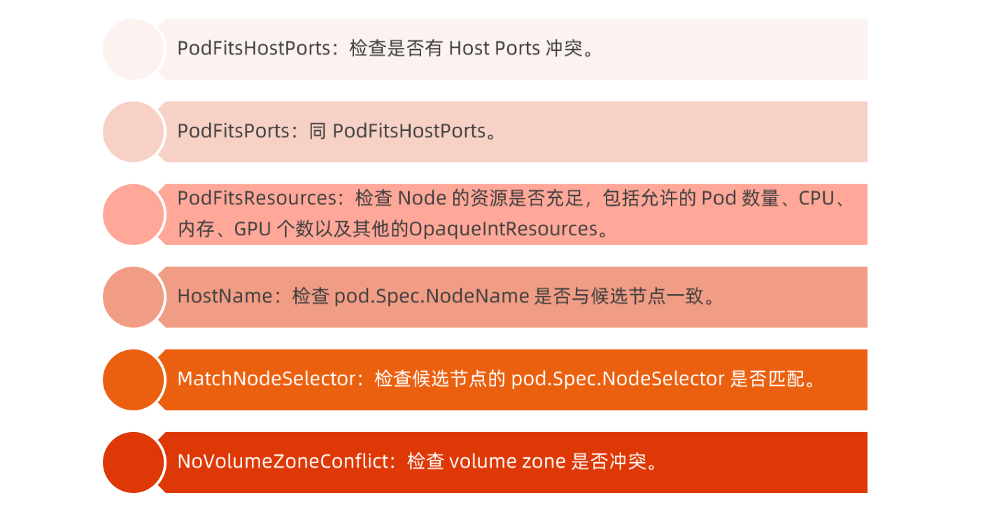

# kubernetes 控制平面组件

## 目录

* <a href="#P1">调度</a>

* <a href="#P2">Controller Manager</a>

* <a href="#P3">kubelet</a>

* <a href="#P4">CRI</a>

* <a href="#P5">CNI</a>

* <a href="#P6">CSI</a>

  

## PART1. 调度

### kube-scheduler

kube-scheduler负责分配调度Pod到集群内的节点上，他监听kube-apiserver，查询未分配Node的pod， 然后根据调度策略为这些Pod分配节点（更新Pod的NodeName字段）。

调度器需要充分考虑多的因素：

* 公平调度；
* 资源高效利用；
* Oos
* affinity 和 anti-affinity;
* 数据本地化（data locality）；
* 内部负载干扰（initer-workload interference）；
* deadlines。

### 调度器

kube-scheduler调度分为两个阶段，predicate和priority；

* predicate：过滤不符合条件的节点；
* priority：优先级排序，选择优先级高的节点。

predicates 策略

