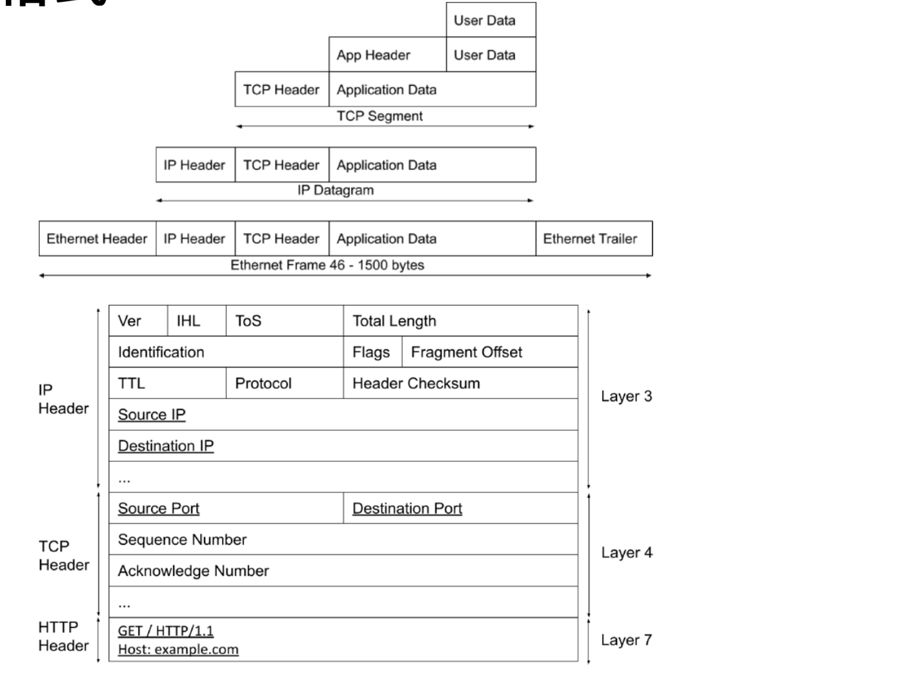
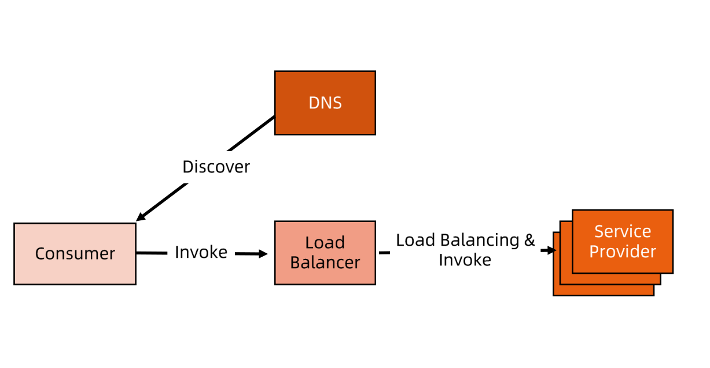
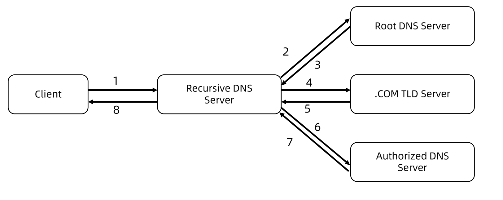
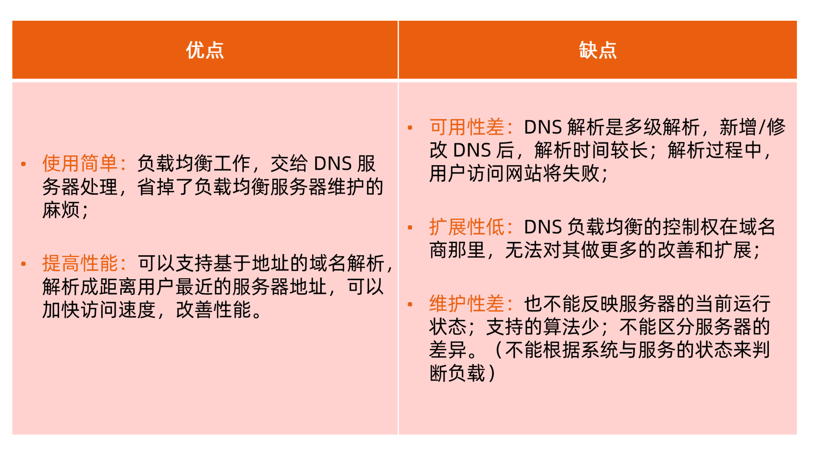
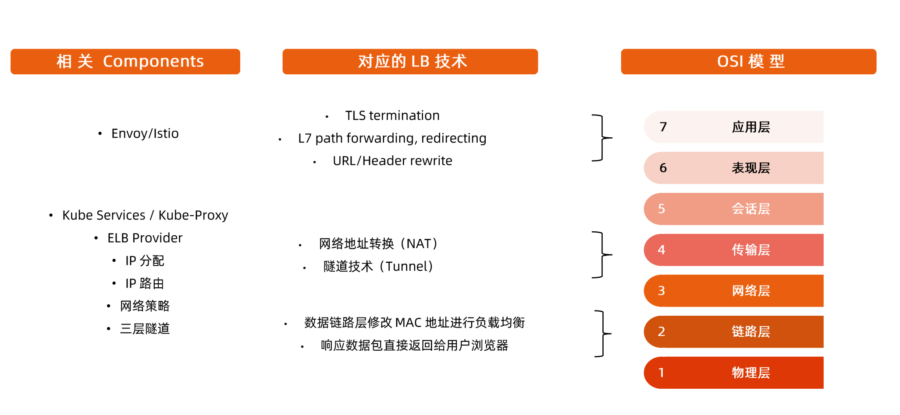
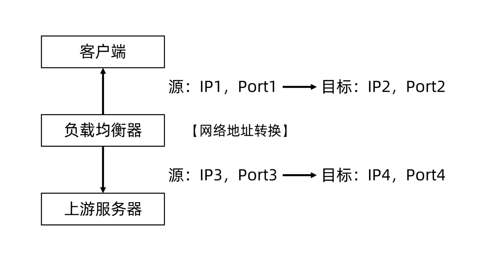
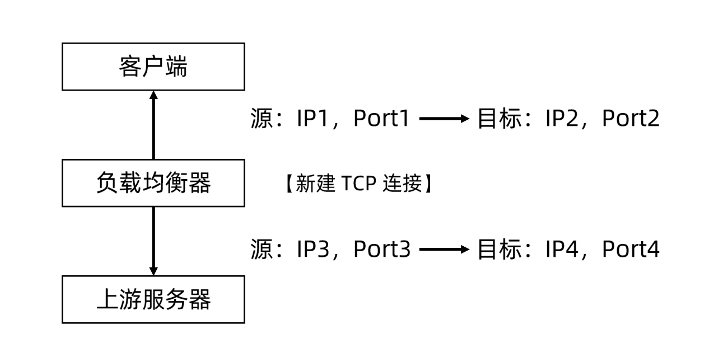
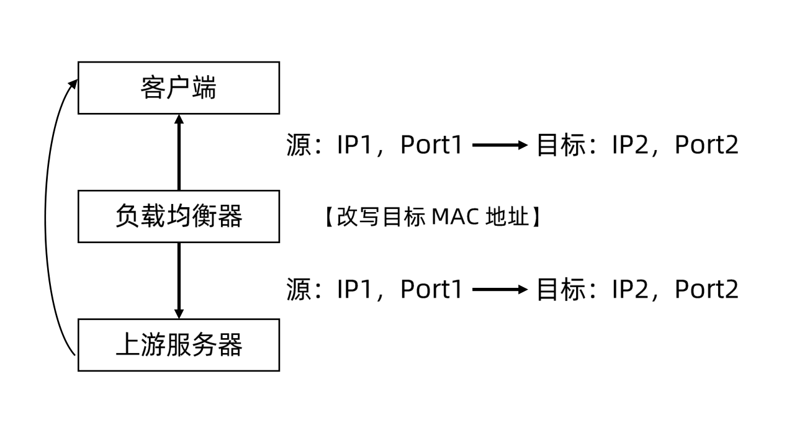

## PART2.服务发布

* 需要把服务发布至集群内部或者外部，服务的不同类型：
  * ClusterIP（headless）
    * 默认类型，为一组 Pod 提供一个虚拟IP，这个虚拟IP就是访问后端 Pod 的一个统一IP入口。他是通过负载均衡策略转发到 Pod。至于如何配置负载均衡策略 则有 kube-proxy 组件完成。
  * NodePort
    * 由于ClusterIP只能在集群内部访问，如果想在集群外部访问则可以通过 NodePort方式，它是在节点上开放某个端口，这个端口接收的请求转发到后端 Pod 里。	
  * LoadBalancer
    * 一般都是云厂商提供，通过特定Service Controller，比如建Service的时候它会在负载均衡中帮你做配置，针对这种类型的Service 一般也会分配LoadBalancer WAP，这种类型的Service 是要跟外部设备去做交互的，需要特定的contronller支持。
  * ExternalName
    * 类似CNAME，通过集群内部的域名访问转发到集群外部
* 证书管理和七层负载均衡的需求。 
* 需要 gRPC 负载均衡如何做？
  * gRPC是基于HTTP/2本身是面向连接的协议，基于传统的TCP、UDP这种做数据包转发，没有办法真正的去做负载均衡。
* DNS需求。
* 与上下游服务的关系。

### 服务发布的挑战

kube-dns

* DNS TTL 问题

Service

* ClusterIP只能对内
* Kube-proxy 支持的 iptables/ipvs 规模有限
* IPVS的性能和生产化问题
* kube-proxy 的 drift 问题
* 频繁的 Pod 变动 （spec change，failover，crashloop）导致 LB 频繁变更
* 对外发布的 Service 需要与企业 ELB 集成
* 不支持 gRPC
* 不支持自定义 DNS 和高级路由功能

Ingress

* spec 的成熟度？

其他可选方案？

### 跨地域部署

需要多少实例？

如何控制失败域，部署在几个地址，AZ， 集群？

如何进行精细的流量控制？

如何做按地域的顺序更新？

如何回滚？

## PART3.微服务架构下的挑战

### 服务发现

* 微服务架构是由一系列职责单一的细粒度服务构成的分布式网状结构，服务之间通过轻量机制进行通信，这时候必然引入一个服务注册发现问题，也就是说服务提供方要注册通告服务地址，服务的调用方要能发现目标服务。
* 同时服务提供方一般以集群方式提供服务，也就引入了负载均衡和健康检查问题。

### 互联网架构发展历程

### 理解网络包格式

### 集中式 LB 服务发现

* 在服务消费者和服务提供者之间有一个独立的LB。
* LB 上有所有服务的地址映射表，通常由运维配置注册。
* 当服务消费方调用某个目标服务时，它向 LB 发起请求，由 LB 以某种策略 （比如 Round-Robin）做负载均衡后将请求转发到目标服务。
* LB 一般具备健康检查能力， 能自动摘除不健康的服务实例。
* 服务消费方通过DNS 发现 LB， 运维人员为服务配置一个 DNS 域名，这个域名指向 LB。

* 

* 集中式 LB 方案实现简单，在 LB 上也容易做成集中式的访问控制， 这一方案目前还是业界主流。
* 集中式 LB 的主要问题是单点问题，所有服务调用流量都经过 LB， 当服务数量和调用量大的时候，LB 容器成为瓶颈，且一旦 LB 发生故障对整个系统的影响是灾难性的。
* LB 在服务消费方和服务提供方之间增加了一跳（hop），有一定性能开销。

### 进程内 LB 服务发现

* 进程内 LB 方案将 LB 的功能以库的形式集中到服务消费方进程里头，该方案也被称为客户端负载方案。
* 服务注册表（Service Registry）配合支持服务自注册和自发现，服务提供方启动时，首先将服务地址注册到服务注册表（同时定期报心跳到服务注册表以表明服务的存活状态）。
* 服务消费方要访问某个服务时，它通过内置的 LB 组件向服务注册表查询（同时缓存并定期刷新）目标服务地址列表，然后以某种负载均衡策略选择一个目标服务地址，最后向目标服务发起请求。
* 这一方案对服务注册表的可用性（Availability）要求很高，一般采用能满足高可用分布式一致的组件（例如Zookeeper，Consul，etcd等）来实现。

* 进程内 LB 是一种分布式模式， LB和服务发现能力被分散到每一个服务消费者的进程内部，同时服务消费方和服务提供方之间是直接调用，没有额外开销，性能比较好。该方案以客户库（Client Library）的方式集成到服务调用方进程里头，如果企业内有多种不同的语言栈，就要配合开发多种不同的客户端，有一定的研发和维护成本。
* 一旦客户端跟随服务调用发布到生产环境中，后续如果要对客户端库进程升级，势必要求服务调用方修改代码并重新发布，所以该方案的升级推广有不小的阻力。

### 独立 LB 进程服务发现

* 针对进程内 LB 模式的不足而提出的一种折中方案，原理和第二种方案类似。
* 不同之处是，将 LB 的服务发现功能从进程内移出来，变成主机上的一个独立进程，主机上的一个或者多个服务要访问目标服务时，他们都是通过同一主机上独立 LB 进程做服务发现和负载均衡。
* LB 独立进程可以进一步与服务消费方进行解耦，以独立集群的形式提供高可用的负载均衡服务。
* 这种模式可以称之为真正的“软负载（Soft Load Balancing）”。
* 独立 LB 进程也是一种分布式方案，没有单点问题，一个 LB 进程挂了之影响该主机上的服务调用方。
* 服务调用方和 LB 之间是进程间的调用，性能好。
* 简化了服务调用方，不需要为不同语言开发客户库，LB 的升级不需要服务调用方改代码。
* 不足是部署较为复杂，环节多，出错调试排查问题不方便。

### 负载均衡

* 系统的扩展可分为纵向（垂直）扩展和横向（水平）扩展：
  * 纵向扩展，是从单机的角度通过增加硬件的处理能力，比如 CPU 处理能力，内存容量，磁盘等方面，实现服务器处理能力的提升，不能满足大小分布式系统（网站）， 大流量，高并发，海量数据的问题；
  * 横向扩展，通过添加机器来满足大型网站服务的处理能力。比如：一台机器不能满足，则增加两台或者多台机器，共同承担访问压力，这就是典型的集群和负载均衡架构。
* 负载均衡的作用（解决的问题）：
  * 解决并发压力，提高应用处理性能，增加吞吐量，加强网络处理能力；
  * 提供故障转移，实现高可用；
  * 通过添加或者减少服务器数量，提供网站伸缩性，扩展性；
  * 安全防护，负载均衡设备上做一些过滤，黑白名单处理等。

### DNS 负载均衡

最早的负载均衡技术，利用域名解析实现负载均衡，在 DNS 服务器，配置多个 A 记录， 这些 A 记录对应的服务器构成集群。

### 负载均衡技术概览

### 网络地址转换

网路地址转换（Network Address Translation，NAT）通常通过修改数据包的源地址（Source NAT）或目标地址（Destination NAT）来控制数据包的转发行为。

### 新建 TCP 连接

为记录原始客户端 IP 地址，负载均衡功能不仅需要进行数据包的源目标地址修改，同时要记录原始客户端 IP地址，基于简单的 NAT 无法满足此需求，于是衍生出了基础传输层协议的负载均衡的另一种方案 -- TCP/UDP Termination 方案。

### 链路层负载均衡

* 在通信协议的数据链路层修改 MAC 地址进行负载均衡。
* 数据分发时，不修改 IP 地址，只修改目标 MAC 地址，配置真实物理服务器集群所有机器虚拟 IP 和负载均衡服务器 IP 地址一致，达到不修改数据包的源地址和目标地址，进程数据分发的目的。
* 实际处理服务器 IP 和数据请求目的 IP 一致，不需要经过负载均衡服务器进行地址转换，可将响应数据包直接返回给用户浏览器，避免负载均衡服务器网卡带宽成为瓶颈。也称为直接路由模式（DR模式）。

### 隧道技术

负载均衡中常用的隧道技术是 IP over IP， 其原理是保持原始数据包 IP 头不变，在 IP 头外层增加额外的 IP 包头后转发给上游服务器。

上游服务器接收 IP 数据包，解开外层 IP 包头后，剩下的是原始数据包。

同样的， 原始数据包中的目标 IP 地址要配置在上游服务器中，上游服务器处理完数据请求以后，响应包通过网关直接放回给客户端。
